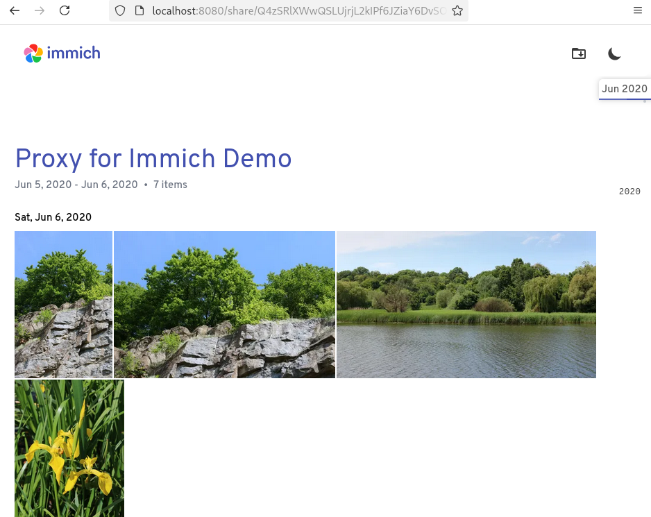
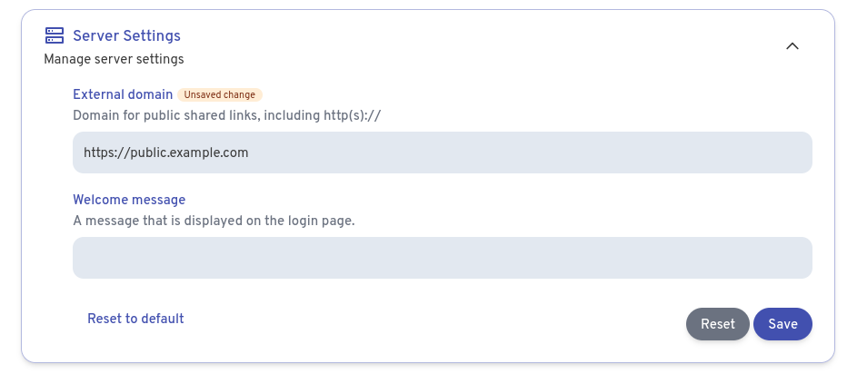

# Proxy for Immich

Share your [immich](https://immich.app/) albums with your friends and family
without exposing the whole API to the public. All this with the comfort of the
immich web UI.



# Features

- Exactly the same as immich

# How to

1. Download the docker compose file

```sh
wget https://raw.githubusercontent.com/tomleb/proxy-for-immich/refs/heads/main/compose.yaml
```

2. Edit the environment variables in the `compose.yaml` file.

- `IMMICH_SERVER_URL`: The immich instance that you want the proxy to be in
  front of. This has to be reachable by Proxy for immich.
- `IMMICH_HOST`: This overrides the Host header when proxying.

3. Configure the external domain on your immich instance to point to the proxy.
   To do this, go to `Administration` > `Settings` > `Server Settings`. You can
   then set the external domain.



4. Run the proxy.

```sh
docker compose up -d
```

You should now be able to access shared albums from the external domain set
previously.

# How does it work

The proxy keeps an allow-list for request paths in
[immich OpenAPI spec](open-api/immich-openapi-specs.json). Request to those paths
are proxied to your immich instance, the others return an error.

A stripped down version of immich's web UI is maintained in this repo.

# License

Same as immich. See [LICENSE](LICENSE).
